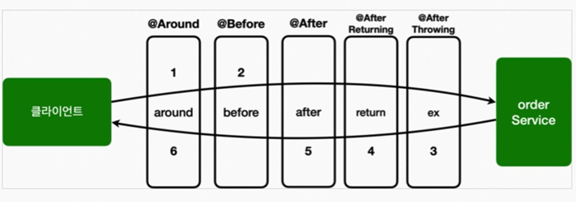

### 어드바이스 종류




#### `@Around` 외에 다른 어드바이스가 존재하는 이유
Q. `@Around` 하나만 있어도 모든 기능을 수행할 수 있다.
그런데 다른 어드바이스들이 존재하는 이유는 무엇일까?

A. 타겟을 호출하는 `joinPoint.preceed()` 를 꼭 해야 하기 때문이다.
호출하지 않을 경우 다음 단계 (before -> after ...) 이 호출되지 않기 때문이다.
치명적인 버그가 발생할 수 있다.
반면에 다른 어드바이스는 `joinPoint.preceed()` 를 호출하지 않아도 된다.


#### **좋은 설계는 제약이 있는것 이다.**

`@Around` 만 있으면 되는데, 왜? 이렇게 제약을 두는 가?
제약은 실수를 미연에 방지한다. 일종에 가이드 역할을 한다.
만약 `@Arround`를 사용했는데, 중간에 다른 개발자가 해당 코드를 수정해서 
호출하지 않았다면? 큰 장애가 발생했을 것이다.

`@Before` 를 사용했다면 이런 문제 자체가 발생하지 않는다.
제약 덕분에 역할이 명확해진다.
다른 개발자도 이 코드를 보고 고민해야 하는 범위가 줄어들고 코드의 의도도 파악하기 쉽다.


### @annotation

@annotation : 메서드가 주어진 애노테이션을 가지고 있는 조인 포인트를 매칭


### bean 
bean : 스프링 전용 포인트컷 지시자, 빈의 이름으로 지정한다.
스프링 빈의 이름으로 AOP 적용 여부를 지정한다. 이것은 스프링에서만 사용할 수 있는 특별한 지시자이다.
``` 
bean(orderService) || bean(*Repository) * 과 같은 패턴을 사용할 수 있다.
```


### 매개변수 전달

#### this, target, args, @target, @within, @annotation, @args

