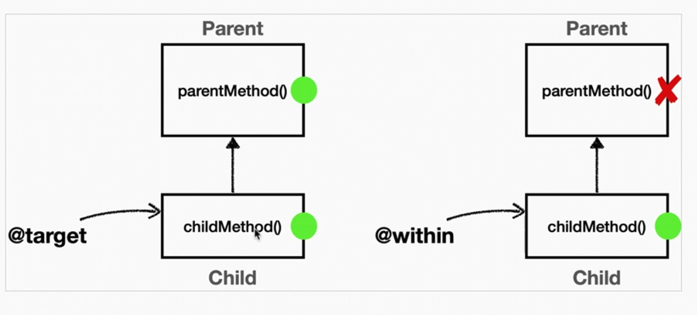

### 포인트컷 지시자

에스펙트J에서 포인트컷을 편리하게 표현하기 위한 표현식

**"포인트컷 지시자"**

포인트컷 지시자는 `execution` 같은 포인터컷 지시자(Pointcut Designator)로 시작한다. 줄여서 `PCD` 라 한다.

- ### 종류
    - `execution`: 메소드 실행 조인 포인트를 매칭한다. 스프링 AOP에서 가장 많이 사용하고, 기능도 복잡하다.
    - `within`: 특정 타입 내의 조인 포인트를 매칭한다.
    - `args`: 인자가 주어진 타입의 인스턴스인 조인 포인트
    - `this`: 스프링 빈 객체(스프링 AOP 프록시)를 대상으로 하는 조인 포인트
    - `target`: Target 객체(스프링 AOP 프록시가 가르키는 실제 대상)를 대상으로 하는 조인 포인트
    - `@target`: 실행 객체의 클래스에 주어진 타입의 애노테이션이 있는 조인 포인트
    - `@within`: 주어진 애노테이션이 있는 타입 내 조인 포인트
    - `@annotation`: 메서드가 주어진 애노테이션을 가지고 있는 조인 포인트를 매칭
    - `@args`: 전달된 실제 인수의 런타임 타입이 주어진 타입의 애노테이션을 갖는 조인 포인트
    - `bean`: 스프링 전용 포인트컷 지시자, 빈의 이름으로 포인트컷을 지정한다.

> `execution`을 가장 많이 사용하고, 나머지는 자주 사용하지 않는다.

### execution 1

```
execution(modifiers-pattern? ret-type-pattern declaring-type-pattern?name-pattern(param-pattern) throws-pattern?)
execution(접근제어자? 반환타입 선언타입?메서드이름(파라미터) 예외?)
```

- 메소드 실행 조인 포인트를 매칭한다.
- ?는 생략할 수 있다.
- \* 같은 패턴을 지정할 수 있다.
- \* 은 아무 값이 들어와도 된다는 뜻이다.
- 파라미터에서 `..` 은 파라미터의 타입과 파라미터 수가 상관없다는 뜻이다.
- 패키지에서 `.` , `..` 의 차이를 이해해야 한다.
    - `.` : 정확하게 해당 위치의 패키지
    - `..` : 해당 위치의 패키지와 그 하위 패키지도 포함
- 클래스를 부모타입으로 해도 매칭된다. 이런 경우를 `typeMatch` 라고 한다.
    - 만약 부모타입으로 했을 경우 해당 메소드들이 부모가 가지고 있어야 한다.
    - `typeMatchNoSupperTypeMethodFalse` 테스트 코드 참고

execution 파라미터 매칭 규칙은 다음과 같다.

- (String) : 정확하게 String 타입 파라미터
- () : 파라미터가 없어야 한다.
- (*) : 정확히 하나의 파라미터, 단 모든 타입을 허용한다.
- (*, *) : 정확히 두 개의 파라미터, 단 모든 타입을 허용한다.
- (..) : 숫자와 무관하게 모든 파라미터, 모든 타입을 허용한다. 참고로 파라미터가 없어도 된다. 0..* 로 이해하면 된다.
- (String, ..) : String 타입으로 시작해야 한다. 숫자와 무관하게 모든 파라미터, 모든 타입을 허용한다.
    - 예) (String) , (String, Xxx) , (String, Xxx, Xxx) 허용


### within
within 지시자는 특정 타입 내의 조인 포인트에 대한 매칭을 제한한다. 쉽게 이야기해서 해당 타입이 매칭되면
그 안의 메서드(조인 포인트)들이 자동으로 매칭된다.
문법은 단순한데 `execution`에서 타입 부분만 사용한다고 보면 된다.

하나만 딱 지정할 수 있다.

> 주의
> 표현식에 부모 타입을 지정하면 안되는 점이다. 
> 정확하게 타입이 맞아야 한다.
> 이 부분에서 `execution`이랑 차이가 난다.


### args
인자가 주어진 타입의 인스턴스인 조인 포인트로 매칭
`execution`의 `args` 부분과 같다.

#### execution과 args의 차이점
- `execution`은 파라미터 타입이 정확하게 매칭되어야 한다. `execution`은 클래스에 선 언된 정보를 기반으로 판단한다.
- `args`는 부모 타입을 허용한다. `args`는 실제 넘어온 파라미터 객체 인스턴스를 보고 판단한다.

- pointcut() : AspectJExpressionPointcut 에 포인트컷은 한번만 지정할 수 있다. 
이번 테스트에서는 테스트를 편리하게 진행하기 위해 포인트컷을 여러번 지정하기 위해 포인트컷 자체를 생성하는 메서드를 만들었다.
- 자바가 기본으로 제공하는 String 은 Object , java.io.Serializable 의 하위 타입이다.
- 정적으로 클래스에 선언된 정보만 보고 판단하는 execution(* *(Object)) 는 매칭에 실패한다. 
- 동적으로 실제 파라미터로 넘어온 객체 인스턴스로 판단하는 args(Object) 는 매칭에 성공한다. (부모 타입 허용)

> 참고 args 지시자는 단독으로 사용되기 보다는 뒤에서 설명할 파라미터 바인딩에서 주로 사용된다.


### @target, @within

- `@target` : 실행 객체의 클래스에 주어진 타입의 애노테이션이 있는 조인 포인트
- `@within` : 주어진 애노테이션이 있는 타입 내 조인 포인트


@target vs @within
- @target 은 인스턴스의 모든 메서드를 조인 포인트로 적용한다.
- @within 은 해당 타입 내에 있는 메서드만 조인 포인트로 적용한다.





> 참고
> @target , @within 지시자는 뒤에서 설명할 파라미터 바인딩에서 함께 사용된다.

> 주의
> 다음 포인트컷 지시자는 단독으로 사용하면 안된다. args, @args, @target
> 이번 예제를 보면 execution(* hello.aop..*(..)) 를 통해 적용 대상을 줄여준 것을 확인할 수 있다.
args , @args , @target 은 실제 객체 인스턴스가 생성되고 실행될 때 어드바이스 적용 여부를 확인할 수
있다.
> 실행 시점에 일어나는 포인트컷 적용 여부도 결국 프록시가 있어야 실행 시점에 판단할 수 있다. 프록시가
없다면 판단 자체가 불가능하다. 그런데 스프링 컨테이너가 프록시를 생성하는 시점은 스프링 컨테이너가 만들어지는 애플리케이션 로딩 시점에 적용할 수 있다. 따라서 args , @args , @target 같은 포인트컷 지시자가 있으면 스프링은 모든 스프링 빈에 AOP를 적용하려고 시도한다. 앞서 설명한 것 처럼 프록시가 없으면 실행 시점에 판단 자체가 불가능하다.
> 문제는 이렇게 모든 스프링 빈에 AOP 프록시를 적용하려고 하면 스프링이 내부에서 사용하는 빈 중에는 final 로 지정된 빈들도 있기 때문에 오류가 발생할 수 있다.
> 따라서 이러한 표현식은 최대한 프록시 적용 대상을 축소하는 표현식과 함께 사용해야 한다.
