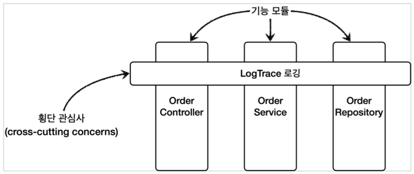

@AspectAOP 프록시 - 적용

스프링에서 @Aspect 애노테이션으로 매우 편리하게 포인트컷과 어드바이스로 
구성되어 있는 어드바이저 생성기능을 지원한다.

> 참고: @Aspect 는 관점 지향 프로그래밍(AOP)을 가능하게 하는 AspectJ 프로젝트에서 제공하는 애노테이션이다.
> 스프링은 이것을 차용해서 프록시를 통한 AOP를 가능하게 한다.

### 관련 파일
`AopConfig`, `LogTraceAspect`

### 자동 프록시 생성기
(`AnnotationAwareAspectJAutoProxyCreator`) 는 `Advisor` 를 자동으로 찾아와서 필요한 곳에
프록시를 생성하고 적용해준다고 했다.

자동 프록시 생성기는 여기에 추가로 하나의 역할을 더 하는데, 바로 `@Aspect` 을 찾아서 `Advisor` 로 만들어준다.
쉽게 이야기해서 지금까지 학습한 기능에 `@Aspect`를 `Advisor`로 변환해서 저장하는 기능도 한다.
그래서 이름 앞에 `AnnotationAware` (애노테이션을 인식하는)가 붙어 있는 것이다.

1. `@Aspect`를 보고 어드바이저(`Advisor`)로 변환해서 저장한다.
2. 어드바이저를 기반으로 프록시를 생성한다.

#### `@Aspect`를 보고 어드바이저 (`Advisor`)로 변환해서 저장 과정
1. 실행: 스프링 어플리케이션 로딩 시점에 자동 프록시 생성기를 호출한다.
2. 모든 @Aspect 빈 조회: 자동 프록시 생성기는 스프링 컨테이너에서 `@Aspect` 애노테이션 붙은 스프링 빈을 모두 조회한다.
3. 어드바이저 생성: `@Aspect` 어드바이저 빌더를 통해 `@Aspect` 애노테이션 정보를 기반으로 어드바이저를 생성한다.
4. @Aspect 기반 어드바이저 저장: 생성한 어드바이저를 `@Aspect` 어드바이저 빌더 내부에 저장한다.

### @Aspect 어드바이저 빌더
`BeanFactoryAspectJAdvisorsBuilder`클래스이다. `@Aspect`의 정보를 기반으로 포인트컷, 
어드바이스, 어드바이저를 생성하고 보관하는 것을 담당한다.
`@Aspect`의 정보를 기반으로 어드바이저를 만들고, `@Aspect` 어드바이저 빌더 내부 저장소에 캐시한다.
캐시에 어드바이저가 이미 만들어져 있는 경우 캐시에 저장된 어드바이저를 반환한다.

#### 어드바이저를 기반으로 프록시를 생성 과정

1. 생성: 스프링 빈 대상이 되는 객체를 생성한다. (`@Bean`, 컴포넌트 스캔 모두 포함)
2. 전달: 생성된 빈 저장소에 등록하기 직전에 빈 후처리기에 전달한다.
3. 
   1. Advisor 빈 조회: 스프링 컨테이너에서 `Advisor` 빈을 모두 조회한다.
   2. @Aspect Advisor 조회: `@Aspect` 어드바이저 빌더 내부에 저장된 `Advisor`를 모두 조회한다.
4. 프록시 적용 대상 체크: 앞서 3-1, 3-2에서 조회한 `Advisor`에 포함되어 있는 포인트컷을 사용해서 해당 객체가
프록시를 적용할 대상인지 아닌지 판단한다. 이때 객체의 클래스 정보를 물론이고, 해당 객체의 모든 메서드를 포인트컷에
하나하나 모두 매칭해본다. 그래서 조건이 하나라도 만족하면 프록시 적용 대상이 된다.
예를 들어서 메서드 하나만 포인트컷 조건에 만족해도 프록시 적용 대상이 된다.
5. 프록시 생성: 프록시 적용 대상이면 프록시를 생성하고 프록시를 반환한다. 
그래서 프록시를 스프링빈으로 등록한다. 만약 프록시 적용 대상이 아니라면 원본 객체를 반환해서 원본 객체를 스프링 빈으로
등록한다.
6. 빈 등록: 반환된 객체는 스프링 빈으로 등록된다.

### 정리

`@Aspect`를 사용해서 애노테이션 기반 프록시를 매우 편리하게 적용해보았다.
실무에서 프록시를 적용할 때는 대부분 이 방식을 사용한다.

지금까지 우리가 진행한 애플리케이션 전반에 로그를 남기는 기능은 특정 기능 하나에 관심이 있는 기능이 아니다.
애플리케이션의 여러 기능들 사이에 걸쳐서 들어가는 관심사이다.
이것을 바로 **횡단 관심사(cross-cutting concerns)**라고 한다. 우리가 지금까지 진행한 방법이 이렇게 
여러곳에 걸쳐 있는 횡단 관심사의 문제를 해결하는 방법이 있다.

