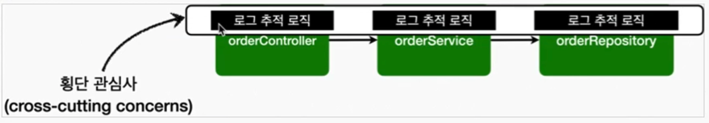
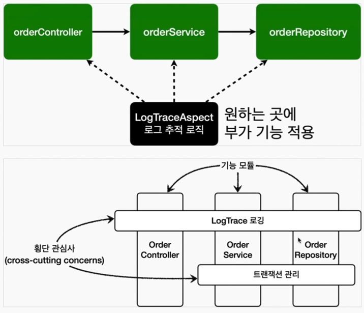
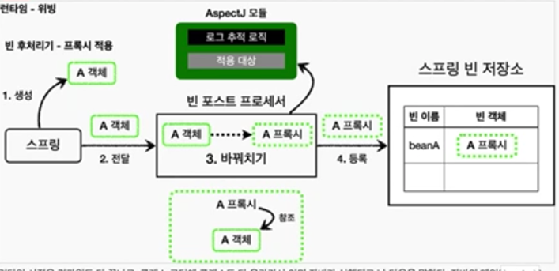

## AOP

### 핵심 기능과 부가 기능

#### 예시
- 핵심 기능: 주문 로직, 회원 로직
- 부가 기능: 트랜잭션, 로그 추적

### 여러 곳에서 공통으로 사용하는 부가 기능

보통 부가 기능은 여러 클래스에 걸쳐서 함께 사용된다. 예를 들어서 모든 애플리케이션 호출을 로깅해야 하는 요구사항을 생각해보자.
이러한 부가 기능은 횡단 관심사(cross-cutting concerns)가 된다. 
쉽게 이야기해서 하나의 부가 기능이 여러 곳에 동일하게 사용된다는 뜻이다.

### 부가 기능 적용 문제
적용 대상에 클래스 모두에게 동일한 코드를 추가해야함.
또한 `try~catch~finally` 같은 구조가 필요하다면 엄청 복잡해짐. 또한 수정에 있어서 취약함.
- 부가 기능을 적용할 때 아주 많은 반복이 필요하다.
- 부가 기능이 여러 곳에 퍼져서 중복 코드를 만들어낸다.
- 부가 기능이 변경할 때 중복 때문에 많은 수정이 필요하다.
- 부가 기능의 적용 대상을 변경할 때 많은 수정이 필요하다.

### 부가 기능 적용 문제를 해결하기 위한 AOP - Aspect(애스팩트)

부가 기능과 부가 기능을 어디에 적용할지 선택하는 기능을 합해서 하나의 모듈로 만들었는데 그것이 바로 `Aspect` 

`Aspect` 는 관점이라는 뜻으로 애플리케이션을 바라보는 관점을 하나하나의 기능에서 횡단 관심사(cross-cutting concerns)
관점으로 달리 보는 것이다.
이렇게 "애스팩트를 사용한 프로그래밍 방식을 관점 지향 프로그래밍 AOP(Aspect-Oriented Programming)" 이라 한다.

"참고로 AOP는 OOP를 대체하기 위한 것이 아니라 횡단 관심사를 깔끔하게 처리하기 어려운 OOP의 부족한 부분을 보조하는
목적으로 개발되었다."

#### Aspect 프레임워크

AOP 의 대표적인 구현으로 [AspectJ 프레임워크](https://www.eclipse.org/aspectj/) 가 있다.
물론 스프링도 AOP를 지원하지만 대부분 AspectJ의 문법을 차용하고, AspectJ가 제공하는 기능의 일부만 제공한다.

- 자바 프로그래밍 언어에 대한 완벽한 관점 지향 확장
- 횡단 관심사의 깔끔한 모듈화
  - 오류 검사 및 처리
  - 동기화
  - 성능 최적화(캐싱)
  - 모니터링 및 로깅

### 부가기능이 적용되는 차이 
- 컴파일 시점: 설계 대상 코드에 에스펙트를 통한 부가 기능 호출 코드가 포함된다. AspectJ를 직접 사용해야 한다.
- 클래스 로딩 시점: 실제 대상 코드에 애스팩트를 통한 부가 기능 호출 코드가 포함된다. AspectJ를 직접 사용해야 한다.
- 런타임 시점: 실제 대상 코드는 그대로 유지된다. 대신에 프록시를 통해 부가 기능이 적용된다. 
따라서 항상 프록시를 통해야 부가 기능을 사용할 수 있다. 스프링 AOP는 이 방식을 사용한다.

#### 런타임 시점

런타임 시점은 컴파일도 다 끝나고, 클래스 로더에 클래스도 다 올라가서 이미 자바가 실행되고 난 다음을 말한다.
자바의 메인 메서드가 이미 실행된 다음이다.
따라서 자바 언어가 제공하는 범위 안에서 부가 기능을 적용해야 한다.
스프링과 같은 컨테이너의 도움을 받고 프록시와 DI, 빈 포스트 프로세서 같은 개념들을 총 동원해야 한다.
이렇게 하면 최종적으로 프록시를 통해 스프링 빈에 부가 기능을 적용할 수 있다.
지금까지 우리가 학습한 것이 바로 프록시 방식의 AOP

#### AOP 적용 위치

- 적용 가능 지점 (조인포인트): 생성자, 필드 값 접근, static 메서드 접근, 메서드 실행
- AspectJ를 사용해서 컴파일 시점과 클래스 로딩 시점에 적용하는 AOP는 바이트코드를 실제 조작하기 때문에 해당 기능을 
모든 지점에 다 적용할 수 있다.
- 프록시 방식을 사용하는 스프링 AOP는 메서드 실행 지점에만 AOP를 적용할 수 있다.
  - 프록시는 메서드 오버라이딩 개념으로 동작한다. 따라서 생성자나 static 메서드 접근,
  필드 값 접근에는 프록시 개념이 적용될 수 있다.
  - 프록시를 사용하는 "스프링 AOP의 조인 포인트는 메서드 실행으로 제한"된다.
- 프록시 방식을 사용하는 스프링 AOP는 스프링 컨테이너가 관리할 수 있는 **"스프링 빈에만 AOP를 적용"** 할 수 있다.

> 참고
> 스프링은 AspectJ의 문법을 차용하고 프록시 방싱의 AOP 를 적용한다. AspectJ를 직접 사용하는 것이 아니다.

> 중요
> 스프링이 제공하는 AOP는 프록시를 사용한다. 따라서 프록시를 통해 메서드를 실행하는 시점에만 AOP가 적용된다.
AspectJ를 사용하면 앞서 설명한 것 처럼 더 복잡하고 더 다양한 기능을 사용할 수 있다.
> 그렇다면 AspectJ를 사용하지 않는 이유는?
> 공부할 내용이 많고, 자바 관련 설정(특별한 컴파일러, AspectJ 전용 문법, 자바 실행 옵션) 도 복잡
> 반면에 스프링 AOP는 별도의 추가 자바 설정 없이 스프링만 있으면 편리하게 AOP를 사용할 수 있다.
> 실무에서는 스프링이 제공하는 AOP 기능만 사용해도 대부분의 문제를 해결할 수 있다.
> 따라서 AOP가 제공하는 기능을 학습하는 것에 집중하자.

### 용어 정리

- **조인 포인트(Join point)**
    - 어드바이스가 적용될 수 있는 위치, 메소드 실행, 생성자 호출, 필드 값 접근, static 메서드 접근 같은 프로그램 실행 중 지점
    - 조인 포인트는 추상적인 개념이다. AOP를 적용할 수 있는 모든 지점이라 생각하면 된다.
    - 스프링 AOP는 프록시 방식을 사용하므로 조인 포인트는 항상 메소드 실행 지점으로 제한된다.
- **포인트컷(Pointcut)**
    - 조인 포인트 중에서 어드바이스가 적용될 위치를 선별하는 기능
    - 주로 AspectJ 표현식을 사용해서 지정
    - 프록시를 사용하는 스프링 AOP는 메서드 실행 지점만 포인트컷으로 선별 가능
- **타켓(Target)**
    - 어드바이스를 받는 객체, 포인트컷으로 결정
- **어드바이스(Advice)** 
  - 부가 기능
  - 특정 조인 포인트에서 Aspect에 의해 취해지는 조치
  - Around(주변), Before(전), After(후)와 같은 다양한 종류의 어드바이스가 있음 
- **애스펙트(Aspect)**
  - 어드바이스 + 포인트컷을 모듈화 한 것 @Aspect 를 생각하면 됨
  - 여러 어드바이스와 포인트 컷이 함께 존재
- **어드바이저(Advisor)**
    - 하나의 어드바이스와 하나의 포인트 컷으로 구성
    - 스프링 AOP에서만 사용되는 특별한 용어
- **위빙(Weaving)**
    - 포인트컷으로 결정한 타켓의 조인 포인트에 어드바이스를 적용하는 것 위빙을 통해 핵심 기능 코드에 영향을 주지 않고 부가 기능을 추가 할 수 있음 AOP 적용을 위해 애스펙트를 객체에 연결한 상태
    - 컴파일 타임(AspectJ compiler)
    - 로드 타임
    - 런타임, 스프링 AOP는 런타임, 프록시 방식
- **AOP 프록시**
    - AOP 기능을 구현하기 위해 만든 프록시 객체, 스프링에서 AOP 프록시는 JDK 동적 프록시 또는 CGLIB 프록시이다.
