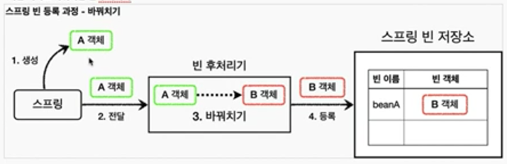
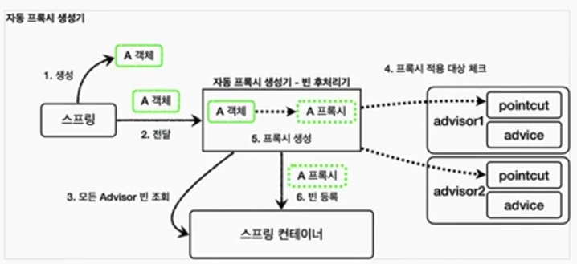

### "빈후처리기"
스프링이 빈 저장소에 등록할 목적으로 생성한 객체를 빈 저장소에 등록하기 직전에 
조작하고 싶다면 빈 후처리기를 사용하면 된다.

빈 포스트 프로세서 (`BeanPostProcessor`)는 번역하면 빈 후처리기인데, 이름 그대로 빈을 생성한 후에 무언가를 
처리하는 용도로 사용한다.


### 빈 후처리기 기능
객체를 조작할 수 도 있고, 완전히 다른 객체로 바꿔치기 하는 것도 가능하다.


### 빈 후처리기 과정
1. 생성: 스프링 빈 대상이 되는 객체를 생성한다. (`@Bean`, 컴포넌트 스캔 모두 포함)
2. 전달: 생성된 객체를 빈 저장소에 등록하기 직전에 빈 후처리기에 전달한다.
3. 후 처리 작업: 빈 후처리기는 전달된 스프링 빈 객체를 조작하거나 다른 객체로 바꿔치기 할 수 있다.
4. 등록: 빈 후처리기는 빈을 반환한다. 전달 된 빈을 그대로 반환하면 해당 빈을 등록되고, 바꿔치기 하면
다른 객체가 빈 저장소에 등록된다.





### 정리

빈 후처리기는 빈을 조작하고 변경할 수 있는 후킹 포인트이다.
이것은 빈 객체를 조작하거나 심지어 다른 객체로 바꾸어 버릴 수 있을 정도로 막강하다.
여기서 조작이라는 것은 해당 객체의 특정 메서드를 호출하는 것을 뜻한다.
일반적으로 스프링 컨테이너가 등록하는, 특히 컴포넌트 스캔의 대상이 되는 빈들은 중간에 조작할 방법이 없는데, 
빈 후처리기를 사용하면 개발자가 등록하는 모든 빈을 중간에 조작할 수 있다.
이 말은 "빈 객체를 프록시로 교체" 하는 것도 가능하다는 뜻이다.

> 참고 - @PostConstruct의 비밀
> `@PostConstruct` 는 스프링 빈 생성 이후에 빈을 초기화 하는 역할을 한다. 그런데 생각해보면 빈의 초기화 라는 것이
> 단순히 `@PostConstruct` 애노테이션이 붙은 초기화 메서드를 한번 호출만 하면 된다. 쉽게 이야기해서 생성된 빈을 한번
> 조작하는 것이다.
> 따라서 빈을 조작하는 행위를 하는 적절한 빈 후처리기가 있으면 될 것 같다.
> 스프링은 `CommonAnnotationBeanPostProcessor` 라는 빈 후처리기를 자동으로 등록하는데, 여기서 `@PostConstruct` 
> 애노테이션이 붙은 메서드를 호출한다. 따라서 스프링 스스로도 스프링 내부의 기능을 확장하기 위해 빈 후처리기를 사용한다.


### 해결한 문제
1. 너무 많은 설정 ProxyFactoryConfig1 ProxyFactoryConfig2 ...
2. 컴포넌트 스캔 (자동으로 등록되는 빈들은 프록시 적용이 불가능 했다.)

-> 빈 후처리기 덕분에 프록시를 생성하는 부분을 하나로 집중
빈 등록하는 과정을 가로채서 원본 대신 프록시를 빈으로 등록할 수 있다.


##### 스프링은 프록시를 생성하기 위한 빈 후처리기를 이미 만들어서 제공하고 있음


> 중요
> 패키지를 기준으로 프록시 대상을 설정했지만 포인트컷을 사용하면 더 깔끔하게 설정 할 수 있다.
1. 프록시 적용 대상 여부를 체크해서 꼭 필요한 곳에만 프록시를 적용 (빈 후처리기 - 자동 프록시 생성)
2. 프록시의 어떤 메서드가 호출 되었을 때 어드바이스를 적용할 지 판단한다. (프록시 내부)


---

## 스프링이 제공하는 빈 후처리기

```implementation 'org.springframework.boot:spring-boot-starter-aop' //추가```

#### 자동 프록시 생성기 - AutoProxyCreator
- 스프링 자동 설정으로 `AnnotationAwareAspectJAutoProxyCreator` 라는 빈 후처리기가 스프링 빈에 자동으로 등록
- 자동으로 프록시를 생성해주는 빈 후처리기
- `Advisor` 들을 자동으로 찾아서 프록시가 필요한 곳에 자동으로 프록시를 적용

> `AnnotationAwareAspectJAutoProxyCreator` @AspectJ와 관련된 AOP 기능도 자동으로 찾아서 처리해준다.

### 자동 프록시 생성기의 작동 과정

1. 생성: 스프링이 스프링 빈 대상이 되는 객체를 생성한다. (`@Bean`, 컴포넌트 스캔 모두 포함)
2. 전달: 생성된 객체를 빈 저장소에 등록하기 직전에 빈 후처리기에 전달한다.
3. 모든 Advisor 빈 조회: 자동 프록시 생성기 - 빈 후처리기는 스프링 컨테이너에서 모든 `Advisor`를 조회한다.
4. 프록시 적용 대상 체크: 앞서 조회한 `Advisor`에 포함되어 있는 포인트컷을 사용해서 해당 객체가 프록시를 적용할 대상인지'
아닌지 판단한다. 이때 객체의 클래스 정보는 물론이고, 해당 객체의 모든 메서드를 포인트컷에 하나하나 모두 매칭해본다.
그래서 조건이 하나라도 만족하면 프록시 적용 대상이 된다. 예를 들어서 10개의 메서드 중에 하나만 포인트컷 조건에 만족해도 프록시 
적용 대상이 된다.
5. 프록시 생성: 프록시 적용 대상이면 프록시를 생성하고 반환해서 프록시를 스프링 빈으로 등록한다. 만약 프록시 적용 대상이 아니라면
원본 객체를 반환해서 원본 객체를 스프링 빈으로 등록한다.
6. 빈 등록: 반환된 객체는 스프링 빈으로 등록한다.


###  중요: 포인트컷은 2가지에 사용된다.

1. 프록시 적용 여부 판단 - 생성 단계
   - 자동 프록시 생성기는 포인트컷을 사용해서 해당 빈이 프록시를 생성할 필요가 있는지 없는지 체크한다.
   - 클래스 + 메서드 조건을 모두 비교한다. 이때 모든 메서드를 체크하는데, 포인트컷 조건에 하나하나 매칭해본다.
   만약 조건에 맞는 것이 하나라도 있으면 프록시를 생성한다.
     - EX) `orderControllerV1`은 `request()`, `noLog()`가 있다. 여기에서 `request()`가 조건에 만족하므로 프록시를 생성
   - 만약 조건에 맞는 것이 하나도 없으면 프록시를 생성할 필요가 없음으로 프록시를 생성하지 않는다.
2. 어드바이스 적용 여부 판단 - 사용 단계
   - 프록시가 호출되었을 때 부가 기능인 어드바이스를 적용할지 말지 포인트컷을 보고 판단한다.
   - 앞서 설명한 예에서 `orderControllerV1`은 이미 프록시가 걸려있다.
   - `orderControllerV1`의 `request()`는 현제 포인트컷 조건에 만족하므로 프록시는 어드바이스를 먼저 호출하고, `target`을 호출한다.
   - `orderControllerV1`의 `noLog()`는 현재 포인트컷 조건에 만족하지 않으므로 어드바이스를 호출하지 않고 바로 `target`만 호출한다.

**"참고"** : 프록시를 모든 곳에 생성하는 것은 비용낭비
꼭 필요한 곳에 최소한의 프록시를 적용해야 한다. 그래서 자동 프록시 생성기는 모든 스프링 빈에 프록시를 적용하는 것이 아니라
포인트컷으로 한번 필터링해서 어드바이스가 사용될 가능성이 있는 곳에만 프록시를 생성한다.


## 하나의 프록시, 여러 Advisor 적용
여러 advisor 의 조건이 맞는다면 하나의 프록시에 적용된다.

