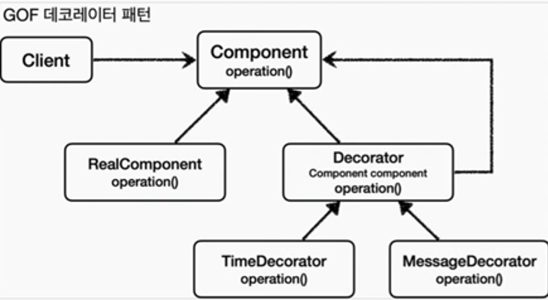

데코레이터 패턴

: **객체에 추가 책임(기능) 을 동적으로 추가**, 기능 확장을 위한 유연한 대안 제공

'Decorator' 기능에 일부 종복이 있다. 
꾸며주는 역할을 하는 'Decorator'들은 스스로 존재할 수 없다. 
항상 꾸며줄 대상이 있어야 한다. 따라서 내부에 호출 대상인 'Component'를 가지고 있어야 한다.
그리고 'Component'를 할상 호출해야 한다. 이 부분이 중복이다. 이런 중복을 제거하기 위해 'component'를 속성으로 가지고 있는
'Decorator' 라는 추상 클래스를 만드는 방법도 고민할 수 있다. 이렇게 하면 추가로 클래스 다이어그램에서 어떤 것이
실제 컴포넌트 인지, 데코레이터인지 명확하게 구분할 수 있다.

