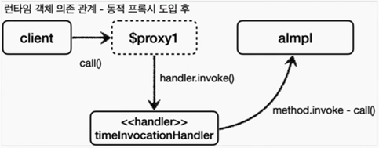

JDK 동적 프록시 소개

이름 그대로 프록시 객체로 동적으로 런타임에 개발자 대신 만들어준다. 그리고 동적 프록시에 원하는 실행 로직을 지정할 수 있다.

> 주의 <br/> JDK 동적 프록시는 인터페이스를 기반으로 프록시를 동적으로 만들어준다. 따라서 인터페이스가 필수이다ㅣ.



"생성된 JDK 동적 프록시"
proxyClass = com.sun.proxy.$Proxy1 이 부분이동적으로 프록시 클래스 정보이다.

```
final BInterface target = new BImpl();
final TimeInvocationHandler handler = new TimeInvocationHandler(target);
// handler 의 로직을 수행하는 동적 프록시 생성
final BInterface proxy = (BInterface) Proxy.newProxyInstance(
        BInterface.class.getClassLoader(),
        new Class[]{BInterface.class},
        handler
);
proxy.call();
```

### 정리

예제를 보면 AImpl, BImpl 각각 프록시를 만들지 않아도 된다. 프록시는 JDK 동적 프록시를 사용해서 동적으로 만들고 TimeInvocationHanlder는 공통으로 사용했다.

### 한계

JDK 동적 프록시는 인터페이스가 필수이다. 그렇다면 V2 애플리케이션 처럼 인터페이스 없이 클래스만 있는 경우에는 어떻게 동적 프록시를 적용할 수 있을까? 이것은 일반적인 방법으로는 어렵고 'CGLIB' 라는
바이트코드를 조작하는 특별한 라이브러리를 사용해야 한다.

