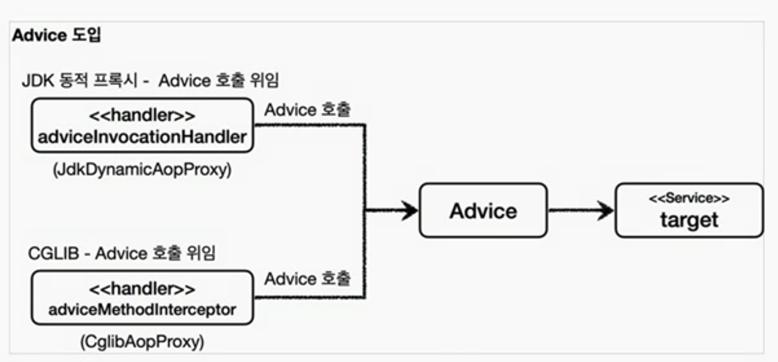

> Q. 인터페이스가 있는 경우에는 JDK 동적 프록시를 적용하고, 그렇지 않은 경우에는 CGLIB를 적용하려면 어떻게 해야할까?

스프링은 동적 프록시를 통합해서 편리하게 만들어주는 프록시 팩토리(`ProxyFactory`)라는 기능을 제공한다.

프록시 팩토리를 통해서 하나로 편리하게 동적 프록시를 생성할 수 있다.

프록시 팩토리는 인터페이스가 있으면 JDK 동적 프록시를 사용하고, 구체 클래스만 있다면 CGLIB를 사용한다.
(* proxyTargetClass = true 옵션으로 CGLIB 만 사용할 수 도 있음)

> JDK 동적 프록시의 Handler 와 CGLIB 의 Interceptor 를 각각 만들어서 넘겨야 하는지?

스프링 이 문제를 해결하기 위해 부가 기능을 적용할 때 **`Advice`만 만들면 된다.**
결과적으로 `InvocationHandler` 나 `MethodIntercetor`는 `Advice`를 호출하게 된다.

프록시 팩토리를 사용하면 `Advice` 를 호출하는 전용 `InvocationHandler`, `MethodInterceptor` 를 내부에서 사용한다.

### 정리
1. 프록시 생성하는 건 ProxyFactory 로
2. 로직은 Advice 에 

### 참고 
> 스프링 부트는 AOP를 적용할 때 기본적으로 `proxyTargetClass=true`로 설정해서 사용한다.
따라서 인터페이스가 있어도 항상 CGLIB를 사용해서 구체클래스를 기반으로 프록시를 생성한다. 

### 용어정리

- "포인트컷" (`Pointcut`): 어디에 부가 기능을 적용할지, 어디에 부가 기능을 적용하지 않을지 판단하는 필터링 로직이다.
주로 클래스와 메서드 이름으로 필터링한다.
이름 그대로 어떤 포인트(Point)에 기능을 적용할지 하지 않을지 잘라서(cut) 구분하는 것이다.
- "어드바이스" (`Advice`): 이전에 본 것 처럼 프록시가 호출하는 부가 기능이다. 단순하게 프록시 로직이라 생각하면 된다.
- "어드바이저" (`Advisor`): 단순하게 하나의 포인트컷과 하나의 어드바이스를 가지고 있는 것이다. 쉽게 이야기해서 "**포인트컷1 + 어드바이스1**" 이다.

### 쉽게 기억하기
- 조언(`Advice`)을 어디(`Pointcut`)에 할 것인가?
- 조언자(`Advisor`)는 어디 (`Pointcut`)에 조언(`Advice`)을 해야할지 알고 있다.

### 역할과 책임
이렇게 구분한 것은 역할과 책임을 명확하게 분리한 것이다.
- 포인트컷은 대상 여부를 확인하는 필터 역할만 담당한다.
- 어드바이스는 깔끔하게 부가 기능 로직만 담당한다.
- 둘을 합치면 어드바이저가 된다. 스프링의 어드바이저는 하나의 포인트컷 + 하나의 어드바이스로 구성된다.

### 중요
스프링의 AOP를 처음 공부하거나 사용하면, AOP 적용 수 만큼 프록시가 생성된다고 착각하게 된다.
실제 많은 실무 개발자들도 이렇게 생각하는 것을 보았다.
스프링은 AOP를 적용할 때, 최적화를 진행해서 지금처럼 프록시는 하나만 만들고, 하나의 프록시에 여러 어드바이저를 적용한다.
정리하면 하나의 `target`에 여러 AOP가 동시에 적용되어도, 스프링의 AOP는 `target` 마다 하나의 프록시만 생성된다.

### 남은 문제
프록시도 깔끔하게 적용하고 포인트컷으로 어디에 부가기능을 적용할지도
명확하게 정의할 수 있다.
원본코드를 전혀 손대지 않고 프록시를 토해 부가 기능도 적용할 수 있었다.

하지만 다음과 같은 문제가 있다.

1. 너무 많은 설정
ProxyFactoryConfigV1, ProxyFactoryConfigV2와 같은 설정 파일이 지나치게 많다는 점이다.
예를 들어서 애플리케이션에 스프링 빈이 100개 있다면 여기에 프록시를 통해 부가기능을 적용하려면 100개의 동적 프록시를 생성해야 하는 코드가 있어야 한다.
최근에는 스프링 빈을 등록하기 귀찮아서 컴포넌트 스캔까지 사용하는데, 
이렇게 직접 등록하는 것도 모자라서, 프록시를 적용하는 코드까지 빈 생성 코드에 넣어야 한다.

2. 컴포넌트 스캔
애플리케이션 V3처럼 컴포넌트 스캔을 사용하는 경우 지금까지 학습한 방법으로는 프록시 적용이 불가능하다.
왜냐하면 실제 객체를 컴포넌트 스캔으로 스프링 컨테이너에 빈으로 등록하는 것이 아니라 `ProxyFactoryConfigV1`에서 한 것처럼
부가 기능이 있는 프록시를 실제 객체 대신 스프링 컨테이너에 빈으로 등록해야 한다.

"두 가지 문제를 한번에 해결하는 방법이 바로 다음에 설명할 빈 후처리기 이다."
